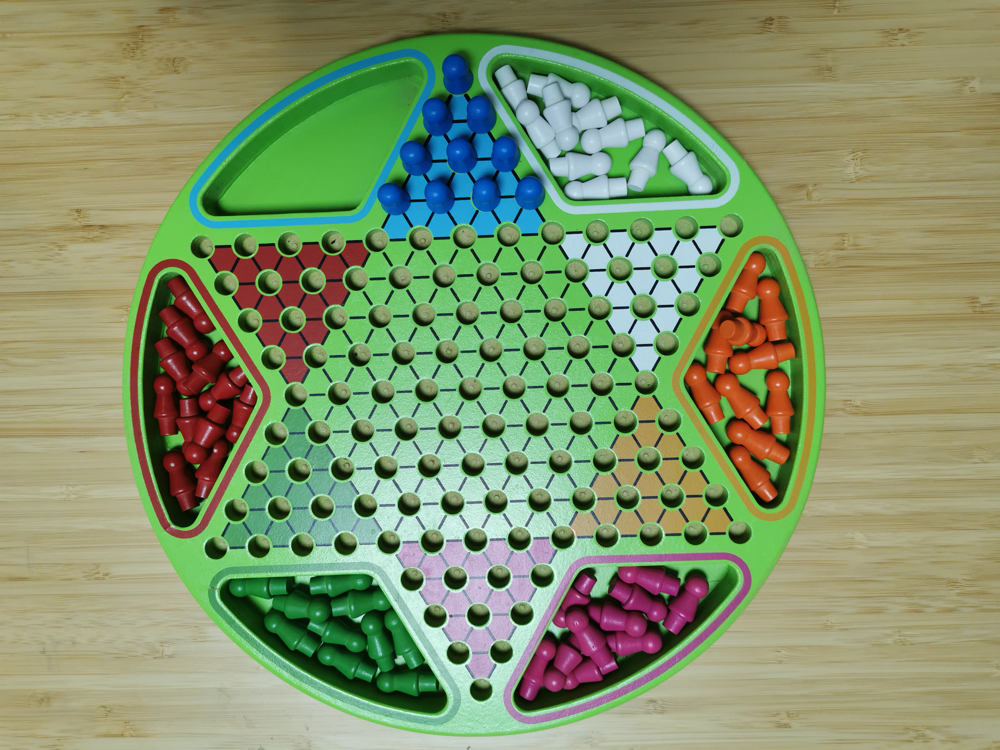
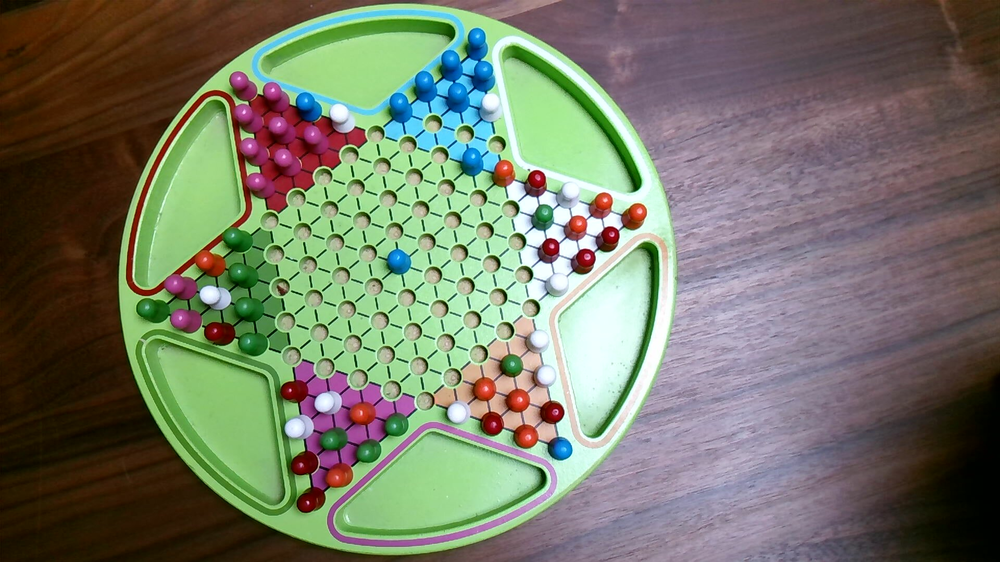

# jumpchess

> Chinese Checkers game system with robot arm control and AI vision (YOLO11n)

<p align="center">
  <a href="README.md"></a>
  &nbsp;
  <a href="README_zh.md"></a>
</p>

<p align="center">
  
  &nbsp;&nbsp;
  
</p>
<p align="center">
  <em>Left: 6-color pieces in starting positions &nbsp;|&nbsp; Right: webcam real-time recognition during a match</em>
</p>

Contact: DingTalk **simomo** &nbsp;|&nbsp; WeChat **crazylitm** &nbsp;|&nbsp; Email **litianmin@gmail.com**

---

## Project Roadmap

| Phase | Goal | Status |
|-------|------|--------|
| Phase 1 | Software Chinese Checkers UI with full move interaction | ✅ Done |
| Phase 2 | Camera-based physical board recognition, mapped to software data structures | ✅ Done 2023.3.11 |
| Phase 3 | Software commanding robot arm to accurately move pieces | 🔄 In Progress |
| Phase 4 | Complete human-vs-machine full gameplay loop | 📋 Planned |
| Phase 5 | Upgrade game AI, strengthen chess engine | 📋 Planned |

---

## Project Structure

```
jumpchess/
├── jump.cpp / jump.h           # Main entry, OpenCV window event loop
├── CheckersUI.cpp / .h         # Board UI core: draw, mouse events, piece movement
├── CheckersMapLimitCheck.cpp   # Coordinate validation, hex distance calculation
├── ChinessJumpChessControl.cpp # Game rule engine: valid jump path calculation (BFS)
├── ChessCamera.cpp / .h        # Camera capture + YOLO inference integration
├── FrameProcessor/             # Image processing: background segmentation, detection
│   ├── BGFGSegmentor           # Background/foreground segmentation
│   ├── Chessboardinfo          # Board state management
│   └── Camera_OutPut_UI        # Camera output UI
├── yolovx/
│   ├── yolo.h                  # YOLO inference interface (upgraded to YOLO11n)
│   └── yolo.cpp                # YOLO inference implementation (anchor-free parsing)
├── models/
│   ├── best.onnx               # Active model: YOLO11n (mAP50 = 99.4%)
│   └── best_yolov5_backup.onnx # Legacy YOLOv5n backup
├── scripts/
│   ├── jump_game2.py           # 2-player AI simulation (RED vs ORANGE)
│   ├── jump_game3v3.py         # 3v3 team AI match (fixed oscillation)
│   ├── jump_game.py            # 2-player AI v1
│   ├── jump_sim.py             # Basic single-player simulation
│   └── export_yolo11.sh        # YOLO11n export + deploy helper
└── build/
    └── jump0                   # Compiled executable
```

---

## Build & Run

### Prerequisites

- macOS (tested on Apple Silicon M3)
- CMake >= 3.7, C++14
- OpenCV (with `dnn` module)
- Python 3.12 + `ultralytics` (for YOLO training/export only)

### Build

```bash
cd build
cmake ..
make -j4
```

### Run

```bash
./build/jump0
```

**To quit:** Press `Q` or `ESC` (hint shown in the bottom-left of the window)

---

## Board Coordinate System

The board uses logical coordinates `(x, y)` with range `x: 1–17, y: 1–17`:

```
Origin (5,1) → screen pixel (600, 30)
screen_x = 600 + x_offset(x,y) × 30
screen_y = 30  + (y − 1)       × 52
```

Starting positions for each color:

| Color | Start Zone | Target (opposite corner) |
|-------|-----------|--------------------------|
| RED | Top (x=5–8, y=1–4) | ORANGE zone (bottom) |
| ORANGE | Bottom (x=10–13, y=14–17) | RED zone (top) |
| GREEN | Top-right (x=10–13, y=5–8) | WHITE zone (left) |
| WHITE | Left (x=5–8, y=10–13) | GREEN zone (top-right) |
| ROSERED | Right (x=14–17, y=10–13) | BLUE zone (bottom-left) |
| BLUE | Bottom-left (x=1–4, y=5–8) | ROSERED zone (right) |

---

## Core Data Structures

```cpp
// Dual-track board state storage
int CircleMap[MAX_CHESS][3];                        // Fast array: [x, y, color]
map<int, list<CircleReturn>> MapChessControlMemory; // Precise path graph

// Sync piece state (both storages kept in sync)
void CheckersUI::updateCircleMap(int i, Point p, ChessColor color);

// Get valid jump paths (BFS)
void ChinessJumpChessControl::ProbableJumpPathALLShow(Point cur, int i, int type, list<Point>* out);
```

---

## YOLO Vision Module

### Version History

| Version | Date | mAP50 | Notes |
|---------|------|-------|-------|
| YOLOv5n | 2023 | ~85% | Original, anchor-based |
| **YOLO11n** | 2026.03 | **99.4%** | Current, anchor-free |

### Model Details

```
Architecture : YOLO11n (Ultralytics, 101 layers, 2.58M params, 6.3 GFLOPs)
Input        : 640×640 RGB
Output       : [1, 10, 8400]  →  [batch, 4+6_classes, proposals]
Classes (6)  : B(blue) G(green) O(orange) R(red) R2(rosered) W(white)
Training set : 185 images (train) + 53 images (val)
```

### Per-Class Accuracy

| Class | Precision | Recall | mAP50 | mAP50-95 |
|-------|-----------|--------|-------|----------|
| B (Blue) | 97.3% | 99.7% | 99.2% | 88.1% |
| G (Green) | 98.3% | 99.6% | 99.5% | 88.8% |
| O (Orange) | 99.8% | 98.3% | 99.5% | 89.6% |
| R (Red) | 94.6% | 100% | 99.0% | 88.8% |
| R2 (Rosered) | 99.8% | 99.4% | 99.5% | 88.6% |
| W (White) | 99.8% | 97.8% | 99.4% | 86.1% |
| **All** | **98.3%** | **99.1%** | **99.4%** | **88.3%** |

### Output Parsing — v11 vs v5

```cpp
// ── YOLOv5 (old, removed) ────────────────────────────────────────────
// Output: [1, 25200, 5+nc] — requires anchor decode + obj_conf filter
// for stride × anchor × grid: decode(pdata[0..4], anchor_w/h)

// ── YOLO11n / YOLOv8 (current) ──────────────────────────────────────
// Output: [1, 4+nc, 8400] — anchor-free, read after transpose
Mat output0 = netOutputImg[0].reshape(1, {4 + nc, 8400});
Mat output_t;
transpose(output0, output_t);     // → [8400, 4+nc]
// Each row: [cx, cy, w, h, cls0, cls1, ..., cls(nc-1)]
// Class score IS the confidence — no obj_conf multiplication needed
```

### Retrain the Model

```bash
cd /path/to/jumpchess
source yolov5_env/bin/activate

# Train (50 epochs, CPU, ~40 min on Apple M3)
yolo train model=yolo11n.pt \
    data=yolov5_dataset/data.yaml \
    epochs=50 imgsz=640 batch=8 \
    project=models/runs name=yolo11n_chess

# Export ONNX (opset=12 for OpenCV DNN compatibility)
yolo export model=models/runs/yolo11n_chess/weights/best.pt \
    format=onnx opset=12 simplify=True

# Deploy
cp models/runs/yolo11n_chess/weights/best.onnx models/best.onnx
```

Or use the helper script:

```bash
bash scripts/export_yolo11.sh
```

---

## Code Review & Refactoring — 2026.04

A full codebase quality scan was performed (scored 1–10, higher = worse). Overall project score: **7.2 / 10**. The following issues were identified and fixed.

### Bug Fixes (logic correctness)

#### `CheckersMapLimitCheck.cpp` — `break` outside `if` block

`getCircleMapPostion()` contained a `break` statement that was **outside** the `if` block due to missing braces, causing the loop to always exit after checking only the first element:

```cpp
// Before (bug): break always fires, only first element ever checked
for(int i=0; i < MAX_CHESS; i++){
    if(CircleMap[i][0] == x && CircleMap[i][1] == y)
        iResult = i;
        break;  // ← NOT inside the if!
}

// After (fixed)
for(int i=0; i < MAX_CHESS; i++){
    if(CircleMap[i][0] == x && CircleMap[i][1] == y) {
        iResult = i;
        break;
    }
}
```

#### `ChinessJumpChessControl.cpp` — `static` variable shadows outer loop variable

Inside `FindPathList()`, a `static int i = 1000` declaration shadowed the outer for-loop's `i`, causing silent incorrect behavior:

```cpp
// Before (bug): shadows outer loop variable i
static int i = 1000;
i++;

// After (fixed): renamed to seq_id
static int seq_id = 1000;
seq_id++;
```

### Simplification (46 lines → 1 line)

#### `CheckersMapLimitCheck.cpp` — `getDistanceFromRED_5_1_point_X()`

The function contained 46 hardcoded `if` statements. Analysis revealed they are **all equivalent** to the single formula `y - 2*x + 9`:

```cpp
// Before: 46 if-statements
if(x == 13 && y == 5) return -12;
if(x == 13 && y == 6) return -11;
// ... 44 more lines ...
if(x == 17) return (y-13)-12;

// After: one formula
return y - 2*x + 9;
```

### Memory Leak Fixes (6 locations)

| File | Leaked Object | Fix |
|------|--------------|-----|
| `ChinessJumpChessControl.cpp` | `list<int> *rec` (GetMatchList return) | Added `delete rec` |
| `ChinessJumpChessControl.cpp` | `list<CircleReturn> *listnode` | Added `delete listnode` |
| `ChinessJumpChessControl.cpp` | `map<...> *p` (FindPathList return) | Added `delete p` |
| `CheckersUI.cpp` | `CircleReturn *node` in initMapList | Added `delete node` |
| `CheckersUI.cpp` | `list<CircleReturn> *listnode` in initMapList | Added `delete listnode` |
| `CheckersUI.cpp` | `list<Point> *p_neighbourNode` in initMapList | Added `delete p_neighbourNode` |

---

## Code Changes — 2026.03

### 1. `CheckersUI.cpp` — Position Number Rendering Bug Fix

**Problem:** After a piece moved, the CircleMap index numbers on board cells were erased and not redrawn.

**Root cause:**
- `chessmapmat_no_chess_org` (background snapshot) is saved before `InitChess()` runs — no numbers in it
- `printChess()` restores from this numberless background → numbers wiped
- `UpdateChessBoard()` rebuilds from same background → all numbers gone

**Fix:**

```cpp
// Fix 1: After UpdateChessBoard() full redraw, re-overlay all position numbers
chessmapmat = mat;
for (int ni = 0; ni < MAX_CHESS; ni++) {
    if (checker.IsLegalPosition(nx, ny)) {
        putText(chessmapmat, text, Point(np.x-10, np.y+2), 1, 1, Scalar(0,0,0));
    }
}

// Fix 2: After mouse move, re-overlay numbers for source and destination cells
printChess(oneMouseDownPose, curChessPoint, old_curColor);
sprintf(ntext, "%d", old_cur_i);
putText(chessmapmat, ntext, Point(oneMouseDownPose.x-10, oneMouseDownPose.y+2), ...);
sprintf(ntext, "%d", cur_i);
putText(chessmapmat, ntext, Point(curChessPoint.x-10, curChessPoint.y+2), ...);
```

---

### 2. `CheckersUI.cpp` — Quit Hint

Added a quit reminder in the bottom-left corner, drawn on every `DrawBackground()` call:

```cpp
putText(chessmapmat, "Press Q to quit",
        Point(10, 880), FONT_HERSHEY_SIMPLEX,
        0.6, Scalar(30,30,30), 1, LINE_AA);
```

---

### 3. `yolovx/yolo.h` + `yolo.cpp` — YOLO v5 → YOLO11n Upgrade

**`yolo.h` changes:**

```cpp
// Removed (YOLOv5 anchor params — not needed in v11)
- const float netAnchors[3][6] = { ... };
- const int   strideSize = 3;
- const float netStride[4] = { 8, 16.0, 32, 64 };

// Kept (public interface unchanged)
const int netWidth  = 640;
const int netHeight = 640;
float classThreshold = 0.25f;
float nmsThreshold   = 0.45f;
```

**`yolo.cpp` — `Detect()` rewrite:**

```cpp
// Old YOLOv5: 3-level nested anchor loop + obj_conf filter (~60 lines)
for (int stride ...) for (int anchor ...) for (int i, j ...):
    float box_score = pdata[4]; ...

// New YOLO11n: transpose then linear scan (~20 lines)
Mat output0 = netOutputImg[0].reshape(1, {4 + nc, 8400});
Mat output_t;
transpose(output0, output_t);           // [8400, 4+nc]
for (int i = 0; i < 8400; i++, pdata += (4+nc)) {
    float cx=pdata[0], cy=pdata[1], w=pdata[2], h=pdata[3];
    // pdata[4..9] are class confidences directly
}
```

---

### 4. `models/best.onnx` — Model Replacement

| | YOLOv5n (old) | YOLO11n (new) |
|--|---------------|---------------|
| File size | 7.2 MB | 10.1 MB |
| mAP50 | ~85% | **99.4%** |
| Output shape | [1, 25200, 11] | [1, 10, 8400] |
| Inference | anchor-based | anchor-free |

Old model backed up to `models/best_yolov5_backup.onnx`.

---

## Python AI Match Scripts

Simulates automatic gameplay by injecting macOS mouse events via CGEvent to drive the `jump0` window.

### Prerequisites

```bash
# Enable Accessibility permission
# System Settings → Privacy & Security → Accessibility → allow Terminal / your app

# Verify
swift -e 'import ApplicationServices; print(AXIsProcessTrusted())'
# Should print: true
```

### 2-Player Match (RED vs ORANGE)

```bash
python3 scripts/jump_game2.py
```

- Greedy scoring + state-history anti-cycle
- Max 400 moves; draw if exceeded
- Benchmark: RED wins within ~125 moves

### 3v3 Team Match

```bash
python3 -u scripts/jump_game3v3.py 2>&1 | tee /tmp/3v3_log.txt
```

| Team | Colors | Goal |
|------|--------|------|
| Team A | RED + GREEN + ROSERED | Reach the 3 opposite corners |
| Team B | ORANGE + WHITE + BLUE | Reach the 3 opposite corners |

**AI Algorithm (v2, oscillation-fixed):**

```
1. Hex distance: hex_dist(dx,dy) = max(|dx|,|dy|) same sign / |dx|+|dy| opposite sign
2. Optimal target assignment: greedily assign each piece to its nearest unfilled target cell
3. Direction penalty: piece moving away from target → deduct n×15 points
4. Per-piece anti-oscillation: track last position per piece; forbid returning to it
5. Jump chain bonus: +2 points only (tiebreaker; doesn't override direction scoring)
6. Target zone protection: piece leaving its target zone → −500 points
```

**Oscillation fix (v1 → v2):**

- **v1 bug:** `dist * 3` jump bonus — a 12-cell reverse jump scored +36, overcoming a −10 direction penalty → backward oscillation
- **v2 fix:** bonus reduced to flat `+2`; added `dir_delta × 15` direction penalty; added `piece_history` dict for per-piece tracking

**Match result (2026.03.31):**

```
Team A 🔴🟢🌸 wins!  Total moves: 549  Time: 13m 37s

Finish order:
  1st  RED     9m 04s
  2nd  ROSERED 9m 45s
  3rd  ORANGE  10m 15s  (Team B)
  4th  BLUE    10m 54s  (Team B)
  5th  GREEN   13m 37s  (secured Team A victory)
```

---

## FAQ

**Q: Mouse not moving during simulation?**
A: Check Accessibility permission: System Settings → Privacy & Security → Accessibility → enable your terminal app.

**Q: Detection accuracy dropped?**
A: Retrain the model — see "Retrain the Model" section. Training data is in `yolov5_dataset/`.

**Q: CMake can't find OpenCV?**
A: `brew install opencv`, or pass `-DOpenCV_DIR=/path/to/opencv` to cmake.

**Q: YOLO-related compile errors?**
A: Confirm `yolovx/yolo.h` and `yolo.cpp` are the latest YOLO11n version (no `netAnchors` variable).

---

## Development Log

| Date | Milestone |
|------|-----------|
| 2020.02 | Initial release: software-only Chinese Checkers UI |
| 2023.01 | Integrated Roboflow dataset, trained YOLOv5n |
| 2023.03.11 | Phase 2 complete: camera-based board recognition |
| 2026.03.31 | Fix piece-number rendering bug; upgrade YOLO11n (mAP50=99.4%); add AI auto-play scripts (2P & 3v3) |
| 2026.04.05 | Code review & refactoring: fix logic bug (`break` outside `if`), fix 6 memory leaks, simplify 46-line if-chain to single formula `y-2x+9`, fix static variable shadowing |
